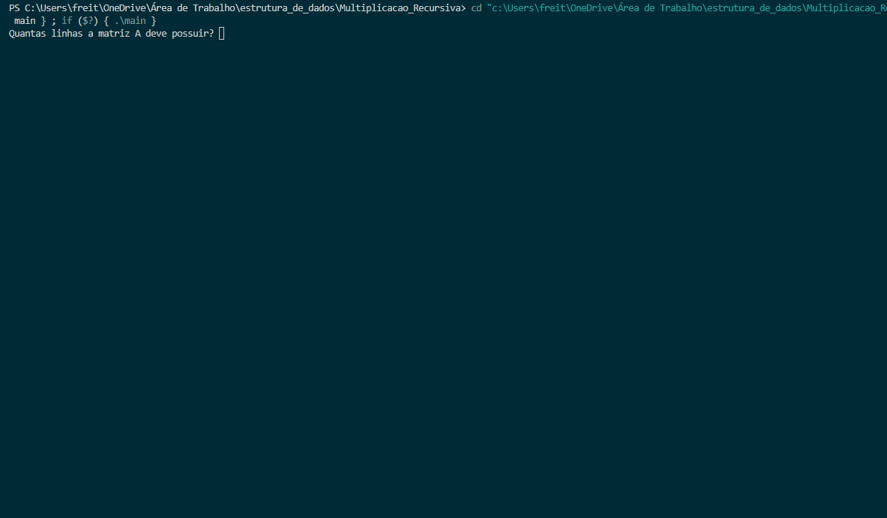

# ⚙️ Multiplicação de Matrizes Recursiva em C

> Uma implementação do algoritmo de multiplicação de matrizes utilizando o paradigma "Dividir para Conquistar", desenvolvida em C com gerenciamento de memória dinâmico.


## 📖 Sobre o Projeto
Este projeto foi desenvolvido como trabalho para a disciplina de **Estrutura de Dados I** e consiste na implementação do algoritmo de multiplicação de matrizes de forma **recursiva**. O objetivo principal foi aplicar o paradigma de **"Dividir para Conquistar"**, uma alternativa ao método iterativo tradicional (com três laços `for`), para solidificar o entendimento de recursão e gerenciamento de memória em um ambiente de baixo nível.

A solução foi projetada para lidar com matrizes de dimensões arbitrárias, exigindo uma etapa de pré-processamento com **padding** (preenchimento com zeros) para adequar as matrizes a um tamanho que seja uma potência de 2, formato ideal para a lógica de divisão recursiva.

## 📸 Demonstração


## ✨ Funcionalidades
- **Multiplicação de Matrizes:** Calcula o produto de duas matrizes (A x B).
- **Dimensões Arbitrárias:** Aceita matrizes de quaisquer dimensões `M x N` e `N x P`, desde que a multiplicação seja matematicamente válida.
- **Padding Dinâmico:** Calcula a próxima potência de 2 necessária e expande as matrizes com zeros para se adequarem ao algoritmo recursivo.
- **Entrada de Dados Flexível:** Permite que o usuário insira os valores da matriz manualmente ou opte por um preenchimento com números aleatórios.
- **Gerenciamento de Memória:** Todo o armazenamento das matrizes é feito com alocação dinâmica, e toda a memória alocada é devidamente liberada ao final da execução.
- **Validação de Entrada:** A interface de console é robusta, validando as entradas do usuário para prevenir erros.

## 🛠️ Tecnologias e Conceitos
- **Linguagem:** C (Padrão C99)
- **Paradigma de Algoritmo:** **Dividir para Conquistar (Divide and Conquer)**
- **Gerenciamento de Memória:** **Alocação Dinâmica (`malloc`, `calloc`, `free`)**, **Ponteiros Duplos (`int **`)**
- **Estruturas de Dados:** `structs`, Arrays 2D
- **Técnicas:** **Recursão**, **Padding** de matrizes, Manipulação de Ponteiros.

## 🚀 Como Executar
O projeto consiste em um único arquivo `main.c` e requer a biblioteca matemática para a função de padding.

**Pré-requisitos:**
* Um compilador C (como GCC ou Clang) instalado.

**Compilação:**
```bash
# Navegue até a pasta do projeto
cd Multiplicacao_Recursiva

# Compile o programa, linkando a biblioteca matemática com a flag -lm
gcc main.c -o matmult -lm
````

**Execução:**

```bash
# Execute o arquivo compilado
./matmult
```

O programa solicitará as informações de configuração (dimensões, tipo de preenchimento) interativamente.

## 🧠 Principais Aprendizados

A construção deste projeto foi um exercício profundo sobre:

  - A tradução de um paradigma algorítmico complexo (Dividir para Conquistar) de sua definição teórica para uma implementação funcional em C.
  - O gerenciamento explícito e rigoroso do ciclo de vida da memória (`alocar` -\> `usar` -\> `liberar`) para múltiplas matrizes dinâmicas, incluindo as dezenas de matrizes temporárias geradas a cada passo da recursão, prevenindo *memory leaks*.
  - A implementação de uma lógica de pré-processamento (*padding*) para adequar os dados de entrada aos requisitos de um algoritmo simétrico.
  - O design de uma aplicação de console robusta com funções modulares e tratamento de erros de entrada do usuário em C.

## 📜 Licença

Distribuído sob a licença MIT.
